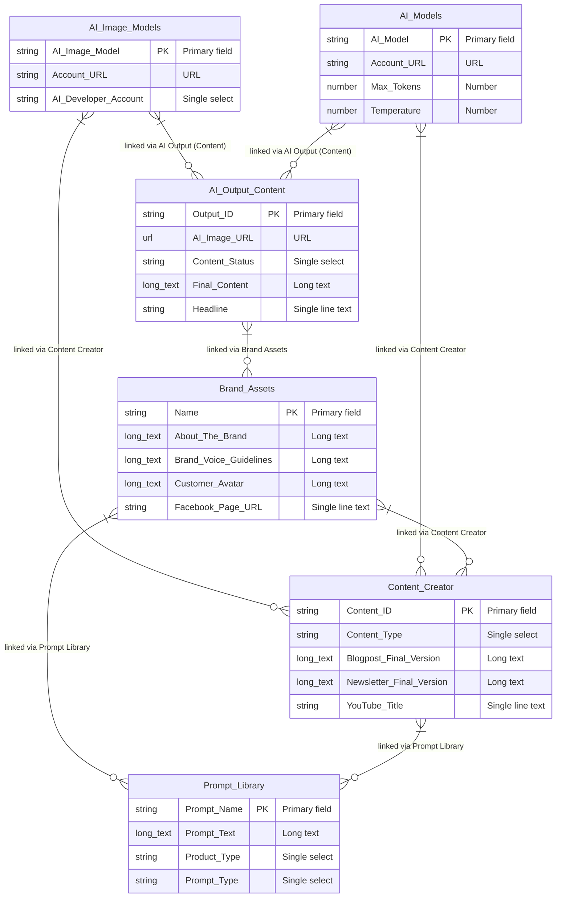

```mermaid
erDiagram
    AI_Image_Models {
        string AI_Image_Model PK "Primary field"
        string Account_URL "URL"
        string AI_Developer_Account "Single select"
    }
    AI_Models {
        string AI_Model PK "Primary field"
        string Account_URL "URL"
        number Max_Tokens "Number"
        number Temperature "Number"
    }
    AI_Output_Content {
        string Output_ID PK "Primary field"
        url AI_Image_URL "URL"
        string Content_Status "Single select"
        long_text Final_Content "Long text"
        string Headline "Single line text"
    }
    Brand_Assets {
        string Name PK "Primary field"
        long_text About_The_Brand "Long text"
        long_text Brand_Voice_Guidelines "Long text"
        long_text Customer_Avatar "Long text"
        string Facebook_Page_URL "Single line text"
    }
    Content_Creator {
        string Content_ID PK "Primary field"
        string Content_Type "Single select"
        long_text Blogpost_Final_Version "Long text"
        long_text Newsletter_Final_Version "Long text"
        string YouTube_Title "Single line text"
    }
    Prompt_Library {
        string Prompt_Name PK "Primary field"
        long_text Prompt_Text "Long text"
        string Product_Type "Single select"
        string Prompt_Type "Single select"
    }

    AI_Image_Models }|--o{ AI_Output_Content : "linked via AI Output (Content)"
    AI_Image_Models }|--o{ Content_Creator : "linked via Content Creator"

    AI_Models }|--o{ AI_Output_Content : "linked via AI Output (Content)"
    AI_Models }|--o{ Content_Creator : "linked via Content Creator"

    AI_Output_Content }|--o{ Brand_Assets : "linked via Brand Assets"

    Brand_Assets }|--o{ Content_Creator : "linked via Content Creator"
    Brand_Assets }|--o{ Prompt_Library : "linked via Prompt Library"

    Content_Creator }|--o{ Prompt_Library : "linked via Prompt Library"
```
